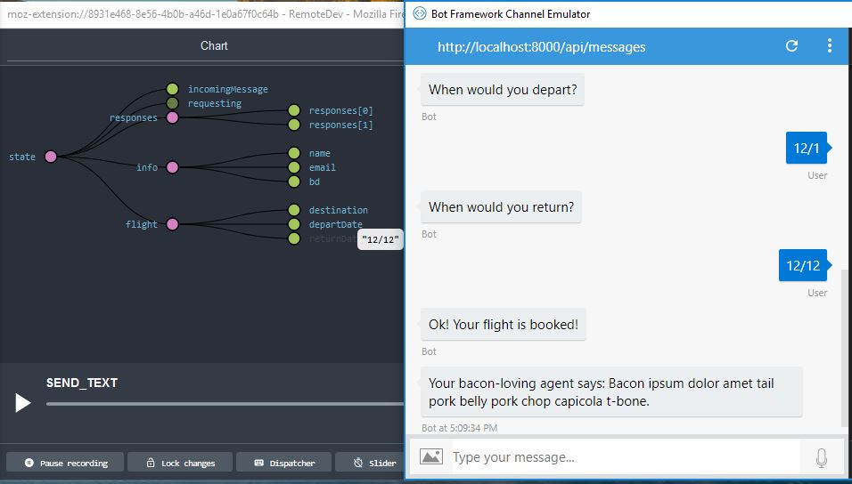

# Botbuilder Redux Common Package

[Botbuilder Redux Middleware](https://haoluo12.visualstudio.com/botbuilder-redux) gives us an easy way to hook the simple yet powerful Redux store to our bot.

This common package is a repository of common interpretations of the state in which you can utilize and start developing your bot quickly.  While the `BotReduxMiddleware` is a thin, unopinionated Bot Middleware.  This package provides more opinions and convention to help bot developers get started quickly.

## Getting Started

**`npm install botbuilder-redux-common --save`**

## How to use
```js

import BotReduxMiddleware, {getStore} from 'botbuilder-redux'
import { IncomingMessageReduxMiddleware, defaultRenderer } from '../../src'

const bot = new Bot(adapter)
    .use(new MemoryStorage()) //BotReduxMiddleware requires storage
    .use(new BotReduxMiddleware(createStore))
    .use(new IncomingMessageReduxMiddleware())
    .onReceive((context) => {
      if (context.request.type !== 'message') {
        return
      }
      // do what you need to the redux state

      defaultRenderer(context, getStore(context)) // sends the responses to the bot automatically
    })

```

## Examples:

### `examples/devToolBot` (Bot with Redux Dev Tool)
The bot spins up a dev server and includes a community-supported redux-devtool middleware.  When you start the bot, and use your remote redux devTools, you can see the state of the bot on any given turn.  Unfortunately, because the store is created on every turn, the dev tool will not have a full history of the conversation (only the current turn).



-------------
## API

### `IncomingMessageMiddleware`

This middleware dispatches three actions:
1. `{type: "CLEAR_RESPONSES"}` - clear the responses
2. `{type: "INCOMING_MESSAGE", data: userMessage}` - message from the user
3. `{type: "INCOMING_INTENT", data: intentObject}` - If you are using the a Bot Recognizer (like LUIS), it will dispatch this action.

It is up to you on how to transform your state in the reducers you define.
